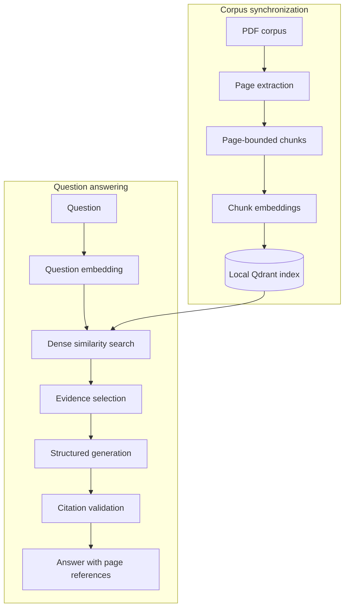

# Page-cited RAG CLI

<div align="center">

[](https://github.com/gpuslave/simple-rag/actions/workflows/ci.yml)

[](flake.nix)
[](LICENSE)

</div>

A Python CLI that answers questions from a PDF corpus and attaches validated PDF-page references to every factual claim.

## Features

- Synchronizes a directory of PDFs into a local vector index.
- Answers questions using only retrieved document evidence.
- Returns readable PDF-page references with every supported claim.
- Refuses to answer when the indexed documents do not provide enough evidence.
- Provides human-readable and JSON output for interactive and automated use.

## Prerequisites

- Nix with flakes enabled
- A RouterAI API key

PDF text is sent to the configured external embedding service during synchronization. When you ask a question, the question and retrieved excerpts are sent to the configured generation model. Do not index documents that you are not permitted to share with those services.

## Development setup

Enter the development environment and install the locked dependencies:

```bash
nix develop
just setup
```

Create a local configuration and set your API key:

```bash
cp rag.toml.example rag.toml
export ROUTERAI_API_KEY='your-api-key'
```

Edit `rag.toml` so that `[corpus].path` points to the directory containing your PDFs, then verify the complete setup:

```bash
just doctor rag.toml
```

## Usage

Preview corpus changes without modifying the index:

```bash
just sync rag.toml --dry-run
```

Synchronize the corpus:

```bash
just sync rag.toml
```

Ask a question:

```bash
just ask "Чем знания отличаются от данных?" rag.toml
```

Example output:

```text
Данные представляют конкретные факты, полученные в результате наблюдений или измерений, а знания отражают связи и закономерности, сформированные на основе опыта. [lesson02.pdf, PDF p. 1]
```

Use JSON output when integrating the CLI with another program:

```bash
just ask "Чем знания отличаются от данных?" rag.toml --json
just sync rag.toml --json
```

Each question is independent. Run `sync` again after adding, changing, or removing PDFs. The configured corpus is authoritative, so a successful synchronization also removes indexed documents that no longer exist in the corpus directory. Use `--dry-run` before applying uncertain changes.

## Commands

Run `just` to list all available commands.

### Application

| Command | Purpose |
| --- | --- |
| `just doctor rag.toml` | Check paths, credentials, and model availability. |
| `just sync rag.toml --dry-run` | Preview corpus changes. |
| `just sync rag.toml` | Synchronize PDFs into the local index. |
| `just ask "Question" rag.toml` | Answer a question with page references. |
| `just ask "Question" rag.toml --json` | Return the validated answer as JSON. |

### Development

| Command | Purpose |
| --- | --- |
| `just setup` | Install locked dependencies. |
| `just test` | Run offline tests. |
| `just test-live` | Run opt-in RouterAI integration tests. |
| `just coverage` | Run tests with the required coverage threshold. |
| `just lint` | Check lint rules and formatting. |
| `just format` | Apply safe lint fixes and formatting. |
| `just typecheck` | Run strict static type checks. |
| `just check` | Run every offline CI check. |
| `just build` | Build the wheel and source distribution. |

## RAG pipeline

The application has two connected paths: `sync` prepares searchable evidence, and `ask` retrieves that evidence before generating an answer.



### Page extraction and chunking

Synchronization starts by extracting text from each PDF page independently. Keeping page boundaries intact is essential: every later chunk can be traced back to one viewer-visible PDF page.

Long pages are divided with a recursive, token-aware text splitter. The splitter uses the `cl100k_base` tokenizer and the configurable `[chunking].size` and `[chunking].overlap` values. Overlap preserves context around split boundaries, at the cost of storing some repeated text. Chunks never cross page boundaries and retain their document path, content version, page number, optional page label, position, and original text.

### Embeddings and Qdrant

Each chunk is sent to the configured embedding model, which converts the text into a dense numeric vector. Semantically related passages should occupy nearby regions of the embedding space even when they do not share the same words.

Qdrant stores each vector together with the chunk metadata required for retrieval and citations. The collection uses cosine distance, so search ranks vectors by their direction rather than their absolute magnitude. This project uses Qdrant's persistent embedded mode: the vector index and synchronization state live under the configured `[state].path`, and no separate Qdrant server is required.

Synchronization treats the PDF directory as authoritative. Unchanged document versions are skipped, changed versions are replaced, and documents missing from the corpus are removed only after the remaining corpus synchronizes successfully.

### Dense retrieval and ANN

When a question is asked, the same embedding model converts it into a query vector. The dense retriever asks Qdrant for chunks whose vectors have the highest cosine similarity to that query. This is semantic retrieval: it can match related meaning without requiring exact keyword overlap, although names, identifiers, and other exact terms can still be challenging for a dense-only retriever.

A naive exact nearest-neighbor search compares the query with every stored vector. Approximate nearest-neighbor (ANN) indexes trade a small amount of recall for much faster searches over large collections. Qdrant uses the graph-based HNSW algorithm for indexed dense-vector search and allows exact search when requested; its [indexing guide](https://qdrant.tech/documentation/manage-data/indexing/) and [search guide](https://qdrant.tech/documentation/search/) explain these modes and their tuning controls.

This application does not force HNSW or exact search parameters. It uses embedded local Qdrant, which is intended for smaller collections and may use an exact scan instead of an ANN path. The application contract is therefore cosine-ranked dense retrieval, not a guarantee that every query executes through HNSW.

The highest-ranked candidates are deduplicated, capped per page, and limited to an overall evidence set using the `[retrieval]` configuration. This prevents one long page from crowding out the rest of the corpus.

### Generation and citations

The generation model receives the question and selected chunks, each labeled with a request-local source ID. It must return a structured answer in which every factual claim cites one or more of those IDs.

Before anything is printed, the application verifies that claims are non-empty and that every cited ID belongs to the retrieved evidence. Chunk-level evidence citations retain scores and excerpts for auditability, while multiple chunks from the same PDF page are normalized into one user-facing page reference. Invalid or unsupported answers fail closed instead of being rendered as grounded results.

## Project documentation

- [Example configuration](rag.toml.example)
- [Domain glossary](CONTEXT.md)
- [Architecture decisions](docs/adr)
- [MIT license](LICENSE)
